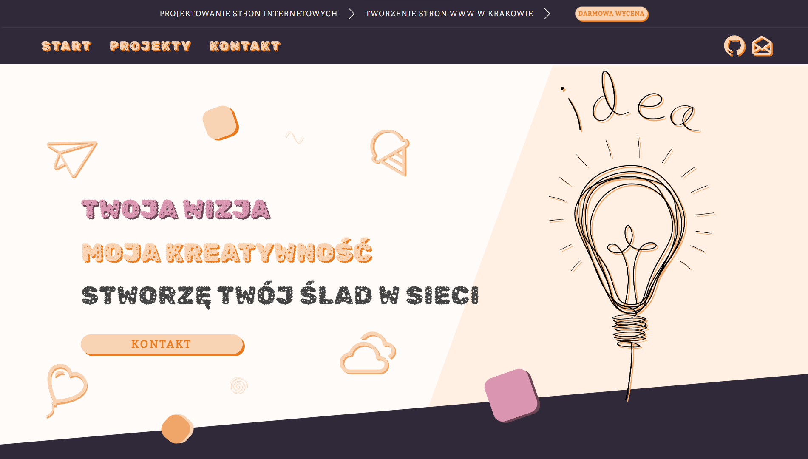
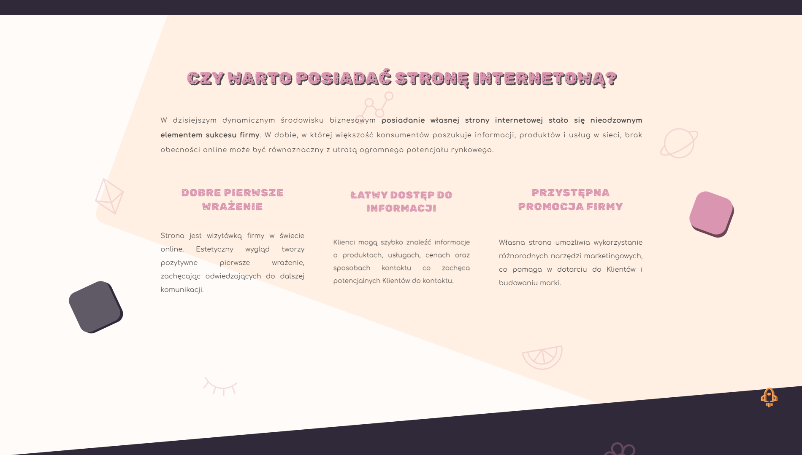
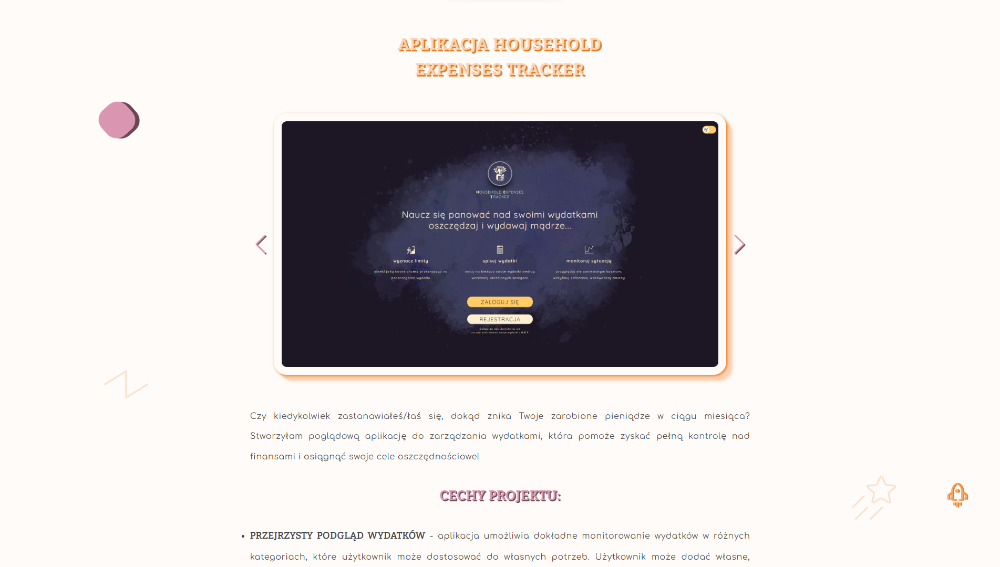
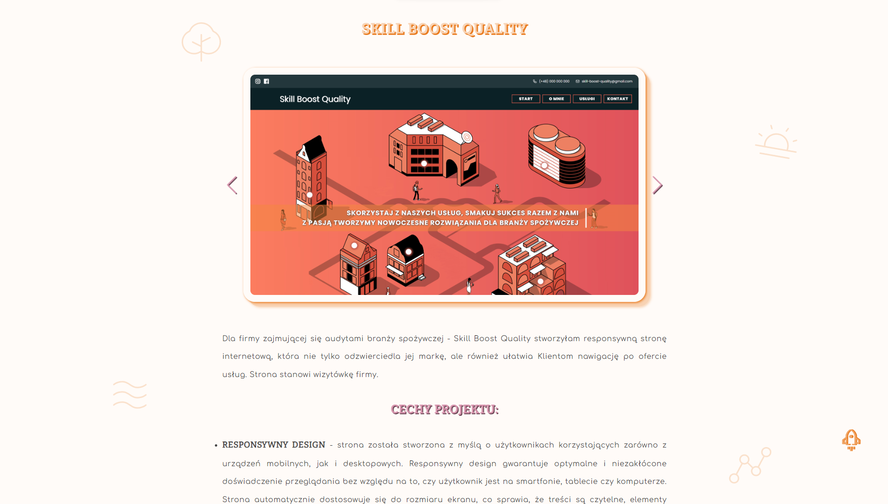

# Portfolio website 🚀

The repository contains the code for the portfolio website. It consists of a home page containing contact instructions, the advantages of having a website and the values ​​of the creator. As well as contact details and menu.

The next subpage is devoted to completed projects. The user will find here brief information about individual projects, a few screenshots, information about the technologies used and a links to the websites.

The last subpage contains a short form with a few questions to facilitate contact.

The entire website is designed with a pastel and candy-themed aesthetic.

## Project Setup

1. Clone the repository
2. Install dependencies: `npm install`
3. Run the project locally: `npm start`

## Technologies

-   HTML,
-   Sass,
-   JavaScript,
-   React,
-   React Router.
