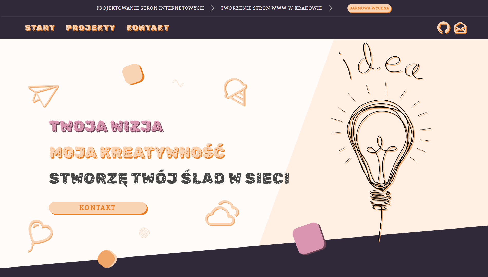
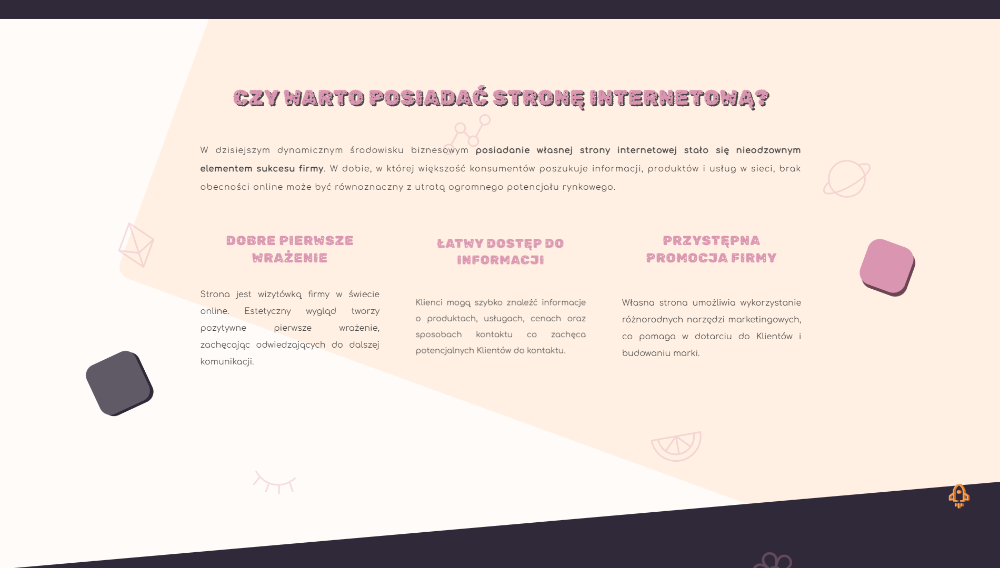
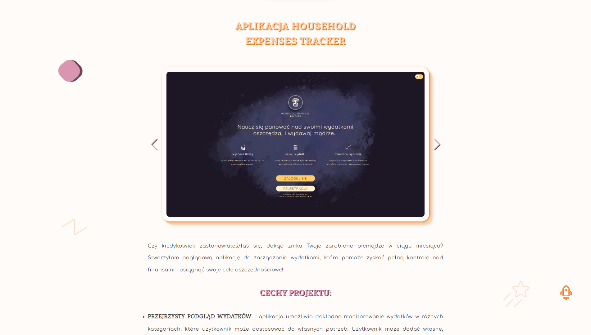
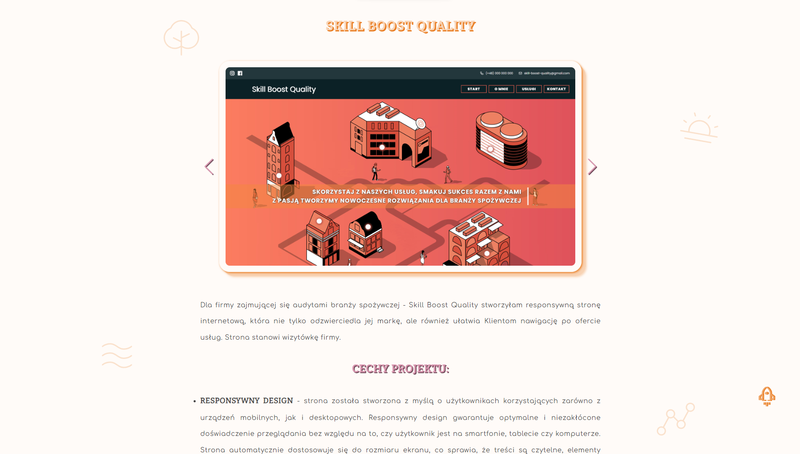

# The project of my website concerns the creation of websites

The repository contains code for the page builder's page. It consists of a home page containing contact instructions, the advantages of having a website and the values ​​of the creator. As well as contact details and menu.

The next subpage is devoted to completed projects. The user will find here brief information about individual projects, a few screenshots, information about the technologies used and a links to the websites.

The last subpage contains a short form with a few questions to facilitate contact.

The entire website is designed with a pastel and candy-themed aesthetic.

## Project Setup

1. Clone the repository to your local computer: git clone https://github.com/JoannaPatyk/joanna-patyk.git
2. Navigate to the project directory: cd joanna-patyk
3. Install dependencies: npm install
4. Run the project locally: npm start

## Technologies

-   HTML,
-   CSS,
-   JavaScript,
-   React,
-   Styled-components,
-   React Router.

## Getting Started with Create React App

This project was bootstrapped with [Create React App](https://github.com/facebook/create-react-app).
